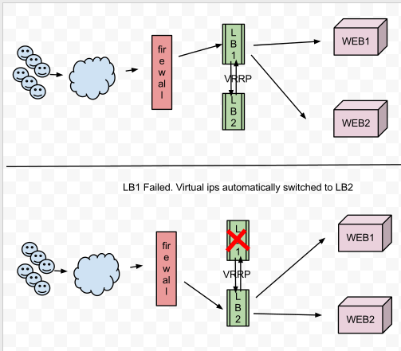

# Keepalived
## What's Keepalived
keepalived is a routing software written in C. The main goal of this project is to provide simple and robust facilities for loadbalancing and high-availability to Linux system and Linux based infrastructures. Loadbalancing framework relies on well-known and widely used Linux Virtual Server (IPVS) kernel module providing Layer4 loadbalancing. Keepalived implements a set of checkers to dynamically and adaptively maintain and manage loadbalanced server pool according their health. On the other hand high-availability is achieved by VRRP(Virtual Router Redundancy Protocol) protocol. VRRP is a fundamental brick for router failover. In addition, Keepalived implements a set of hooks to the VRRP finite state machine providing low-level and high-speed protocol interactions. Keepalived frameworks can be used independently or all together to provide resilient infrastructures.
## Network Scenario:
1. LB1 Server: 192.168.0.70 (ens192)
2. LB2 Server: 192.168.0.73 (ens192)
3. Virtual IP Address: 192.168.0.118


   
## Install Required Packages
`yum install gcc kernel-headers kernel-devel`

`apt-get install linux-headers-$(uname -r)`
## Install Keepalived
`yum install keepalived`

`apt-get install keepalived`

## Configuration([See more](https://access.redhat.com/documentation/en-us/red_hat_enterprise_linux/7/html/load_balancer_administration/ch-initial-setup-vsa)):
**Server LB1:**

`vim /etc/keepalived/keepalived.conf`

```
! Configuration File for keepalived

global_defs {
   notification_email {
     sysadmin@mydomain.com
     support@mydomain.com
   }
   notification_email_from lb1@mydomain.com
   smtp_server localhost
   smtp_connect_timeout 30
}

vrrp_instance VI_1 {
    state MASTER
    interface ens192
    virtual_router_id 101
    priority 101
    advert_int 1
    authentication {
        auth_type PASS
        auth_pass 1111
    }
    virtual_ipaddress {
        192.168.0.118
    }
}
```
**Server LB2:**

`vim /etc/keepalived/keepalived.conf`

```
! Configuration File for keepalived

global_defs {
   notification_email {
     sysadmin@mydomain.com
     support@mydomain.com
   }
   notification_email_from lb2@mydomain.com
   smtp_server localhost
   smtp_connect_timeout 30
}

vrrp_instance VI_1 {
    state MASTER
    interface ens192
    virtual_router_id 101
    priority 100
    advert_int 1
    authentication {
        auth_type PASS
        auth_pass 1111
    }
    virtual_ipaddress {
        192.168.0.118
    }
}
```

### Set Linux Kernel parameters as follows to support Floating IP

```
echo "net.ipv4.ip_nonlocal_bind = 1" >> /etc/sysctl.conf

sysctl -p
```
### Enable logging
`vim /etc/sysconfig/keepalived`
```
KEEPALIVED_OPTIONS = “-D”

modified to

KEEPALIVED_OPTIONS=”-D -d -S 0”
```
`vim /etc/rsyslog.conf`

Append this line:

```
local0.* 	/var/log/keepalived.log
```
## Run Keepalived
```
systemctl enable keepalived
systemctl start keepalived
systemctl restart rsyslog
tail -f /var/log/keepalived.log
```
